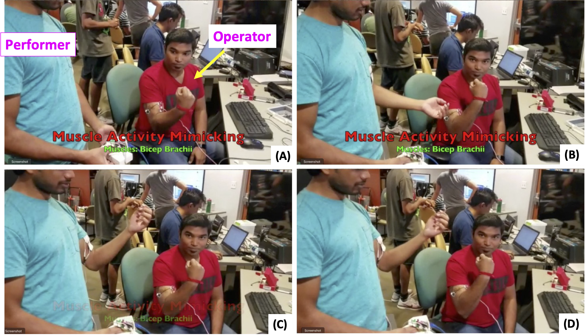

We further extended the capabilities of EMS to develop a novel interaction technique for human tele-operation and for dynamic activity training using electromyography (EMG) and electrical muscle stimulation. We explored the transference of muscle activity between people to enable remote tele-operation. This technique presents new possibilities and applications in rehabilitation and dynamic activity training in physical reality and virtual/augmented reality applications.

Fig.1 - Human Tele-operation EMS prototype demonstrating the transfer of muscle activity from Operator to Performer. (A) The operators bicep fitted with EMG sensors records muscle activity during a bicep flex action. (B), (C), and (D) The operators EMG signal representative of the bicep muscle activation is applied as an electrical stimulus to the bicep muscle performer to generate the same physiological response of the bicep flex action.

Our system utilized EMG sensors to record muscle activity on one person (Operator) and reproduced the same muscle activity on another person (Performer) through the application of the EMG signal as an EMS stimulation pattern to the same muscles on the performer. The EMS applied to the same muscle on the performer invokes an involuntary muscular response which mimics the original muscle activity from the operator in real time. This presents an opportunity to develop sports training protocols for learning new movements and improve muscle memory to enhance performance. Human tele-operation may also allow development of art, dance, martial arts programs to transfer muscle activity from a coach/teacher to an athlete/student to develop fast learning capabilities. 

