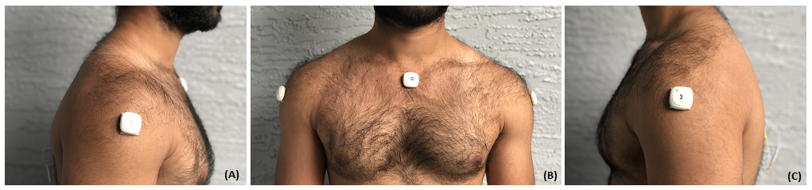

Habitually poor posture can lead to repetitive strain injuries that lower an individual’s quality of life and productivity. Slouching over computer screens and smart phones are common examples that leads to soreness, and stiffness in the neck, shoulders, upper and lower back regions. To help cultivate good postural habits, researchers have proposed slouch detection systems which alert users when their posture requires attention. However, such notifications are disruptive and can be easily ignored. We address these issues with a new physiological feedback system that uses inertial measurement unit sensors to detect slouching, and electrical muscle stimulation to automatically correct posture. In a user study involving 36 participants, we compare our automatic approach against two alternative feedback systems and through two unique contexts-text entry and gaming. We find that our approach was perceived to be more accurate, interesting, and outperforms alternative techniques in the gaming but not text entry scenario.
We developed a physiological feedback loop-based wearable intervention prototype relying on IMU sensors and EMS (illustrated in Figure 1). Our prototype employed three Metawear MMC wireless sensors for measuring angular changes, and the  package for presenting the EMS feedback.  We developed a user interface using the Metawear C\# SDK and integrated the EMS hardware to complete the physiological feedback loop. As slouching was mainly characterized by torso inclination and forward rolling of the shoulders\cite{kamil2015effect}, IMU 1 was placed at the center of the collar bone above the chest (illustrated in Figure \ref{fig:sensorplacement} (B)) and the other IMU's 2 and 3 were placed on the center of each deltoid (illustrated in Figure \ref{fig:sensorplacement} (A) \& (C)).

Fig.1 - 4K Mountains Wallpaper

The change in posture was calculated from the angular information obtained from the IMU sensors. The user's torso inclination angle was calculated from the pitch of IMU1, and the roll angles on the shoulders were calculated from the roll of IMU's 2 and 3. Our system detected slouching when the user's current torso inclination and shoulder roll angles, both approached and remained at a threshold level for a period of 5 seconds. The threshold level is preset as $-3\si{\degree}$ of the torso inclination and shoulder roll angles recorded in the slouched position during calibration. $-3\si{\degree}$ was chosen to overcome measurement errors without increasing false positives and a 5 second time duration ensured random movements do not lead to false positive slouch detection. These design choices were validated during our pre-study trials. The threshold angle of $-3\si{\degree}$ was used to initiate the 5 seconds timer, and the slouch angles detected were recorded at the end of the timer when the feedback was presented. The purpose of the timer was to ensure false positives due to participant behavior do not trigger the feedback response.

When slouching was detected, the automatic correction feedback was presented by applying electrical stimulus to the rhomboid muscles (illustrated in Figure~\ref{fig:electrodeplacement}) for generating a pulling force in the opposite direction from the slouched posture and thereby, generating a physiological response to bring the user back to the upright or correct position. Two pairs of electrodes were utilized for contraction of the rhomboid muscles which causes the shoulders blades to be pulled back, thus unrolling the shoulders and bringing the torso back to the upright posture. IMU and EMS calibration play a crucial role in the effectiveness of the system. The calibration process included correcting IMUs offset value in the upright position of the user and recording the angular change in the slouched posture with respect to the upright position. 
The EMS intensity calibration was manually incremented to deliver an intensity that was optimal for generating involuntary muscular contraction and avoid any pain. This EMS intensity provided to the user for generating the necessary pulling force for correcting the slouched posture and restoring the upright position was recorded and utilized during the experiment. The TENS device was able to deliver intensities between (0-100mA). A continuous 75 Hz square wave pulse at the recorded EMS intensity and a pulse width of 100 $\mu$s was supplied as the electrical stimulus to the users.
