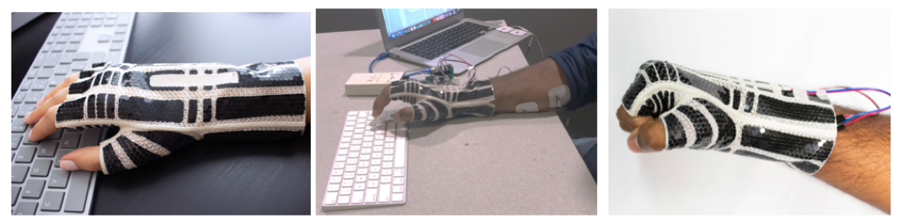

We developed a novel interaction technique to extend the capabilities of Electrical Muscle Stimulation (EMS) and its ability to enable motor function in quadriplegic or paralysed patients. We integrated EMS with a speech recognition engine to activate EMS to extend mobility to the hand for performing grasp and lifting functions. Our prototype employed a Microsoft Speech recognition engine to recognize wake-up words, phrases and sentences. Our speech recognition engine was integrated with a speech library and programmed to recognize specific voice commands such as "Activate hand", "Grab the object", "Lift the object", "Drop the Object", and "Deactivate hand". Our prototype was able to demonstrate activating EMS on the muscles of the hand and arm to perform grasping and lifting actions when the correct commands were delivered as illustrated in Figure 1. The integration of speech recognition with EMS presents opportunities for developing rehabilitation protocols for remote physiotherapy and products to extend motor function in paralysed, stroke, and PD patients. 

Fig.1 - Voice activated EMS prototype responding to specific voice commands recognized by the speech recognition engine for (A) Activation of EMS on hand, (B) EMS invoking involuntary contraction of hand muscles for grasping object, (C) EMS invoking involuntary contraction of Bicep muscles for lifting object, (D) Deactivation of EMS on bicep for dropping object.

